# Limestone Data Challenge 2026

A systematic approach to a multi-part data challenge involving price prediction, imputation, and trading strategy optimization on a dataset of 53 flour-price columns over 3,650 days (~10 years) with ~49% missing values.

## Challenge Overview

The dataset contains 53 columns (`col_00` through `col_52`) representing daily flour prices from different sources. Some columns are **farmers** (independent price sources) and some are **indices** (weighted averages of farmers). Approximately 49% of the values are missing (NaN). The challenge consists of 5 problems:

| Problem | Task | Metric |
|---------|------|--------|
| **1** | Classify columns as farmer or index; find index weights | Correct identification + coefficient accuracy |
| **2** | Fill all missing values | Imputation accuracy (RMSE) |
| **3** | Buy 100kg from hidden-price columns, minimize cost | Excess over oracle cost |
| **4** | Arbitrage: buy cheap hidden, sell to index columns | Profit capture rate |
| **5** | Place limit orders on hidden columns | Score efficiency vs oracle |

### Dataset at a Glance

**Missing data heatmap** — red cells are NaN, green are observed. The ~49% missingness is spread unevenly across columns and time:

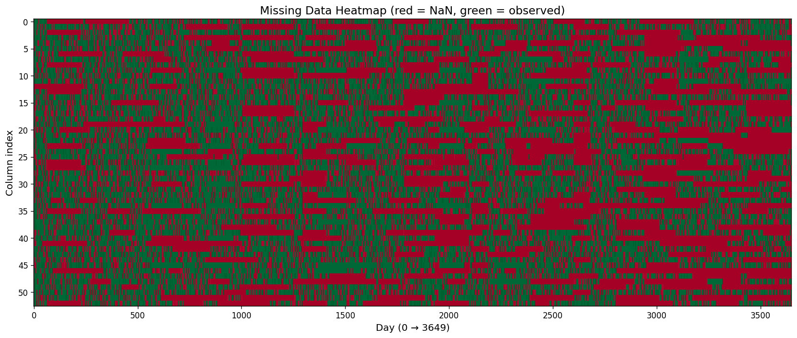

**Market level over time** — the row-wise mean of all observed prices on each day reveals a clear shared upward trend across all 53 columns:

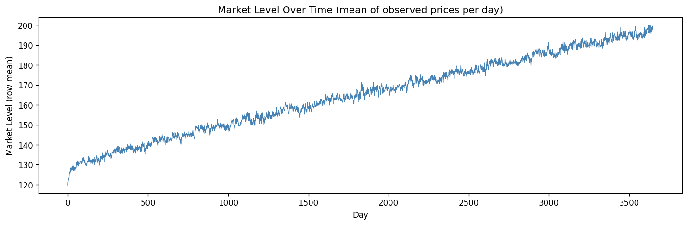

**Deviation distribution** — after subtracting the market level, per-column deviations are tightly centered near zero (σ ≈ 10), which makes them far easier to predict than raw prices (~150–170):

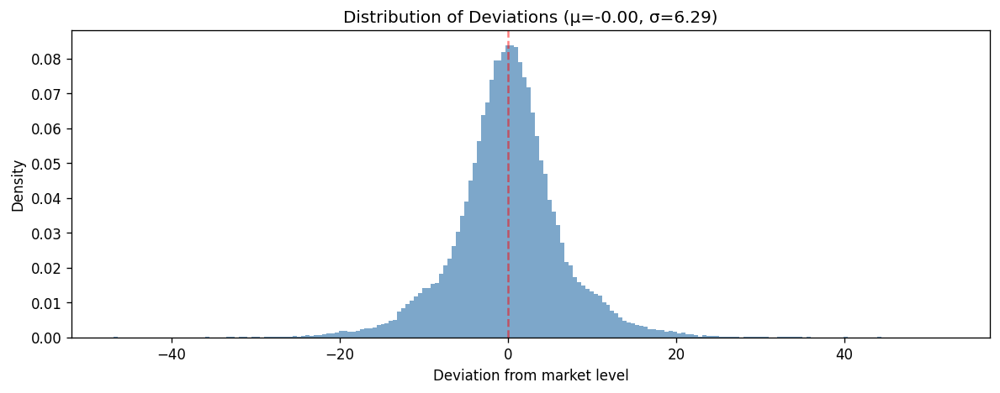

---

## Problem 1: Index Classification & Coefficient Estimation

### Goal
Identify which of the 53 columns are indices (weighted averages of farmers) vs independent farmers, and determine the exact constituent weights.

### Approach

#### Step 1: Identification via NNLS Regression

The key insight: **an index can be perfectly reconstructed from other columns; a farmer cannot.**

For each column, we regress it against all 52 others using **Non-Negative Least Squares (NNLS)**:

```
col_j ≈ w₁·col₀ + w₂·col₁ + ... + w₅₂·col₅₂    (wᵢ ≥ 0)
```

We use NNLS (not OLS) because index weights are non-negative by construction — a real price index can't have negative contributions.

Since the data has ~49% NaN, we first create a complete "proxy" dataset via linear interpolation + forward/backward fill. This is a rough fill, but sufficient for identification — the R² signal from true indices is so strong (~0.99) that imputation noise doesn't mask it.

**NNLS R² for each column** — the 6 red bars are the identified indices, clearly separated from farmers:

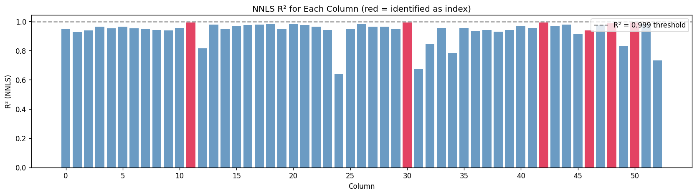

**Result:** 6 columns showed R² ≈ 0.99: `col_11, col_30, col_42, col_46, col_48, col_50` — these are the **indices**. The remaining 47 are **farmers**.

#### Step 2: Constituent Selection via Greedy Search

The Step 1 regression used all 47 farmers, but each index only uses 2–7 of them. To find the minimal constituent set:

1. **Exhaustive pair search** — try every C(47,2) = 1,081 farmer pair, keep the best R²
2. **Greedy expansion** — add the farmer that improves R² the most, stop when improvement < 0.001

This runs on **raw observed data only** (rows where the index and all candidate farmers are simultaneously non-NaN) to avoid imputation artifacts in the final weights.

#### Step 3: Cross-Validation with FFT

To validate the greedy results, we independently identify constituents in the **frequency domain**:

1. FFT-transform all columns (on interpolated data)
2. Run NNLS on stacked real + imaginary components
3. Keep farmers with FFT weight > 0.05

If a farmer truly contributes to an index, it appears in both time-domain (greedy) and frequency-domain (FFT) analyses. Comparing the two catches spurious or missed constituents.

#### Final Coefficients

The final weights are fitted via NNLS on raw overlap rows using the validated constituent set:

| Index | Constituents | Weight Sum |
|-------|-------------|-----------|
| col_11 | col_28 (0.47), col_20 (0.26), col_26 (0.20), col_07 (0.07) | 1.00 |
| col_30 | col_18 (0.42), col_34 (0.16), col_06 (0.13), col_19 (0.11), col_40 (0.10), col_03 (0.08), col_01 (0.01) | 1.00 |
| col_42 | col_26 (0.65), col_18 (0.18), col_12 (0.12), col_52 (0.04) | 1.00 |
| col_46 | col_15 (0.35), col_34 (0.24), col_09 (0.15), col_32 (0.13), col_23 (0.13) | 1.00 |
| col_48 | col_05 (0.59), col_23 (0.19), col_45 (0.14), col_26 (0.08) | 1.00 |
| col_50 | col_26 (0.56), col_28 (0.22), col_32 (0.22) | 1.00 |

### Analysis Plots

**Greedy sparse-formula fit — predicted vs actual for each index (time-domain constituents):**

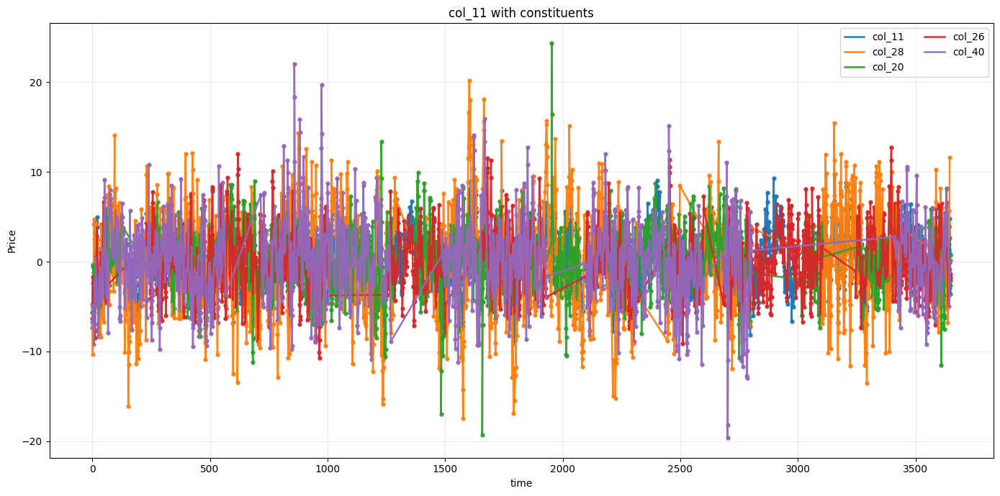
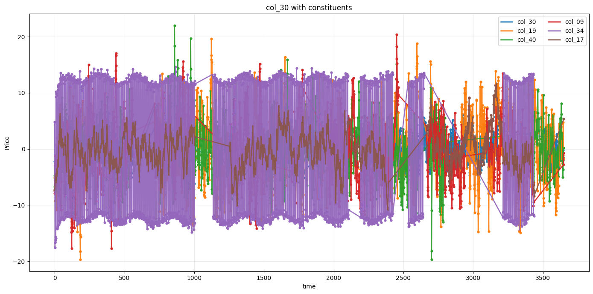
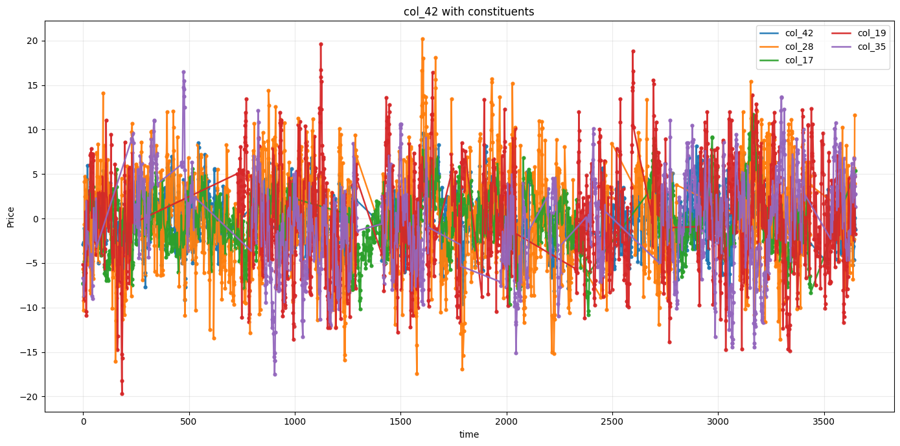
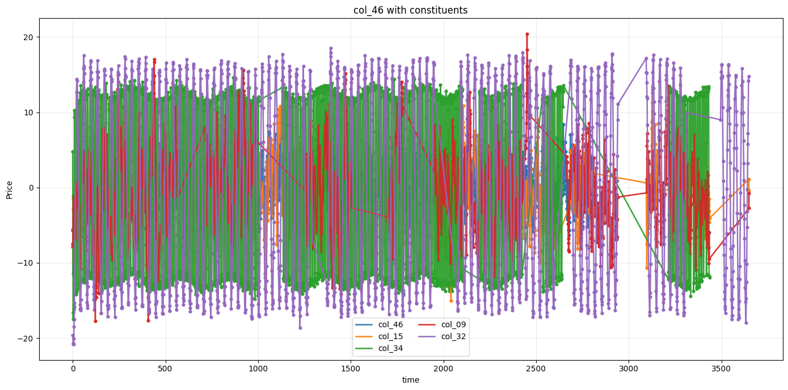
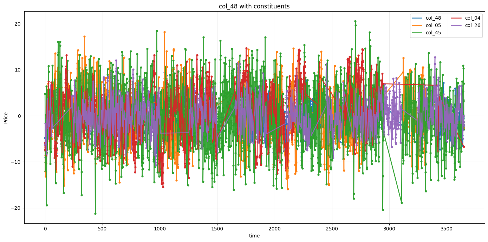
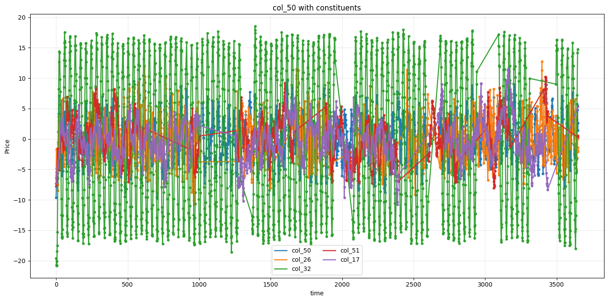

**Sparse-formula residuals — confirming near-zero reconstruction error:**

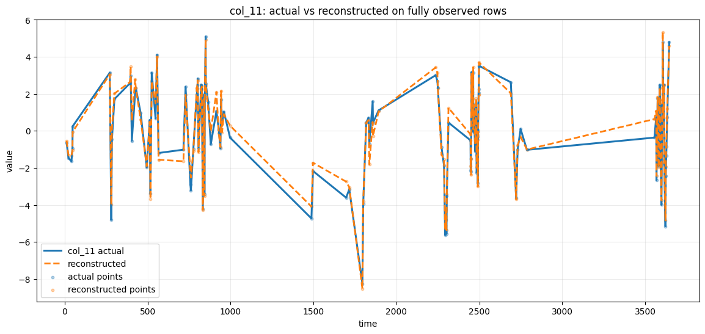
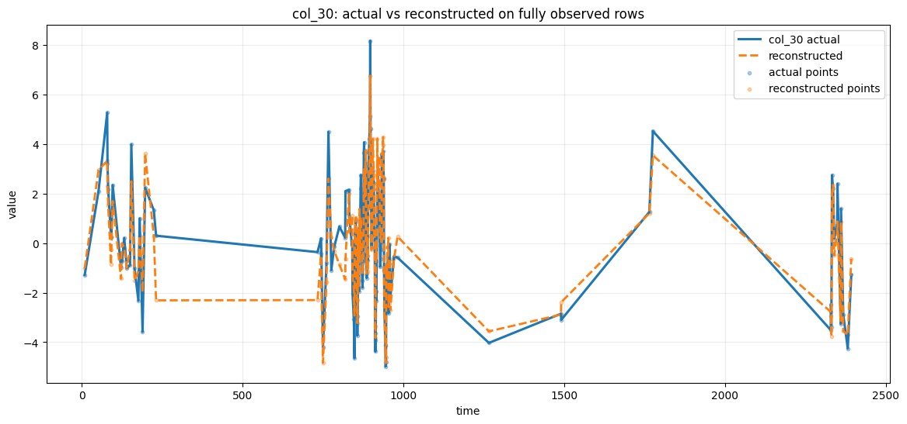
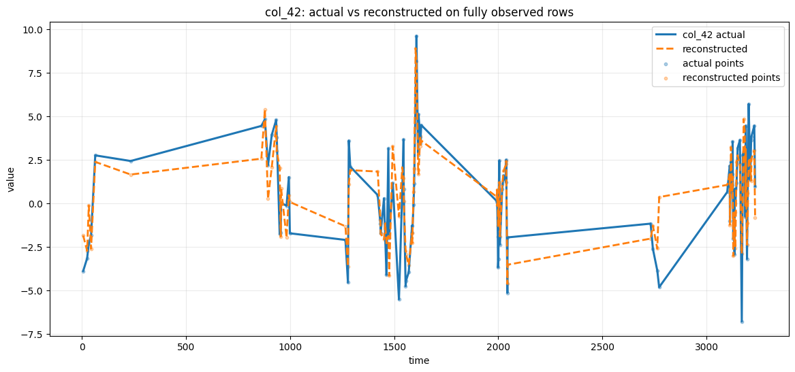
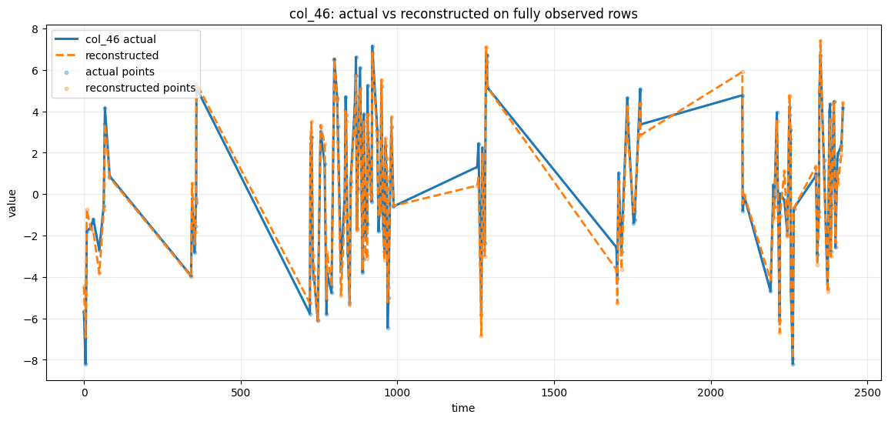
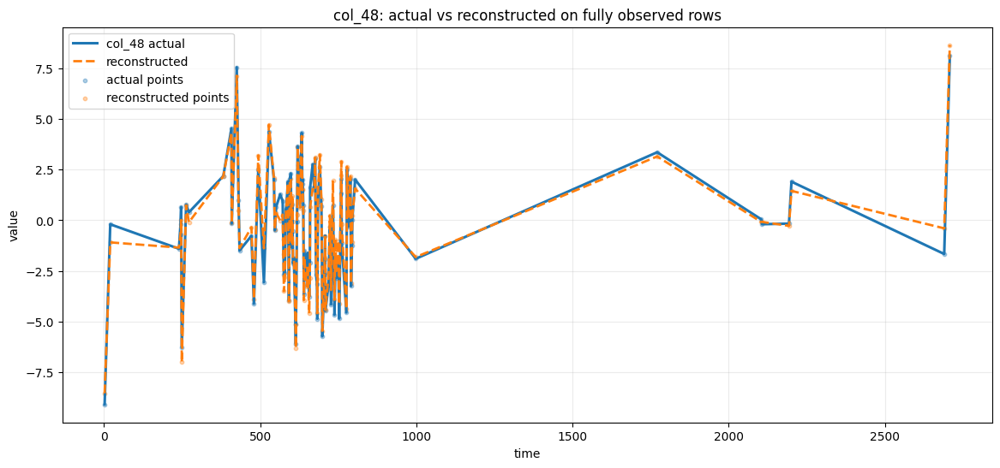
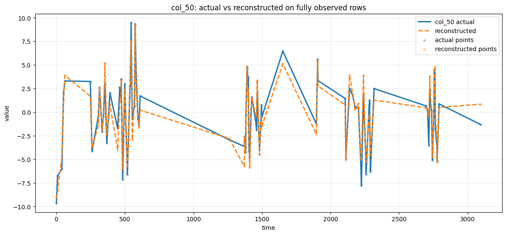

**Final formula inspection — T2 coefficients predicted vs actual:**


**Index residuals — near-zero residuals confirm the formula accuracy:**


**T2 cross-validation — comparing time-domain and frequency-domain constituent weights:**

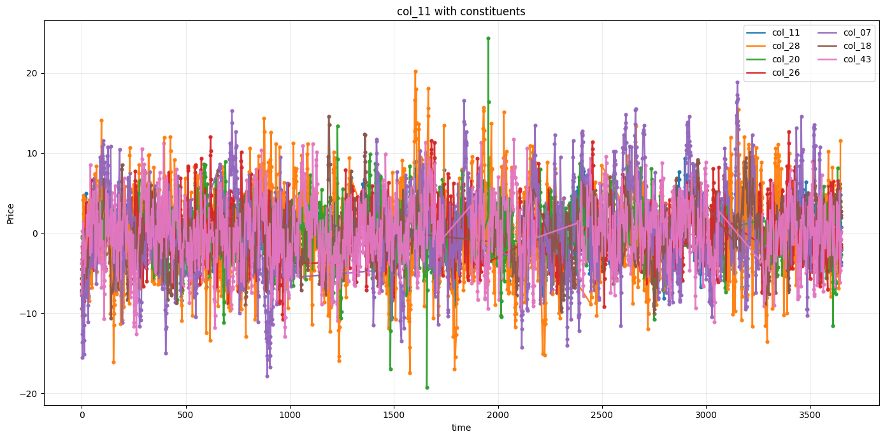
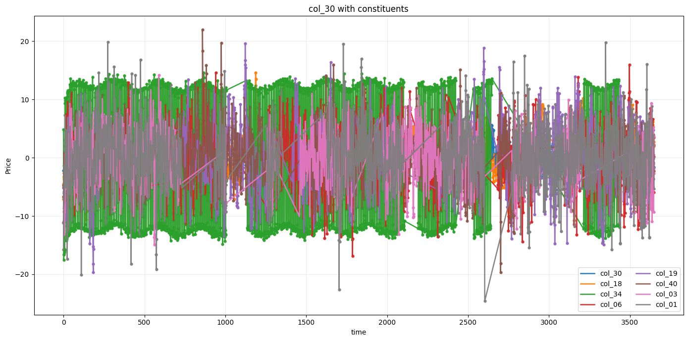

---

## Problem 2: Imputation (Fill All Missing Values)

### Goal
Fill all ~49% NaN values in the 3,650 × 53 matrix with accurate estimates.

### Key Insight: Price = Market Level + Deviation

Every flour price on a given day can be decomposed:

```
price[row, col] = market_level[row] + deviation[row, col]
```

- **Market level** — the row-wise mean of observed values (shared daily trend)
- **Deviation** — column-specific offset from the market average (small, stable, easier to impute)

Imputing in deviation space dramatically improves KNN performance because deviations are small numbers (~±10) centered near zero, vs raw prices (~150–170).

### Pipeline (9 Steps)

#### Step 0: Reverse Inference (Algebraic Fill)

Using the index formulas from Problem 1, algebraically solve for missing values:

```
If col_50 is observed and col_26, col_32 are observed but col_28 is NaN:
  col_28 = (col_50 − 0.56 × col_26 − 0.22 × col_32) / 0.22
```

Works only when exactly 1 farmer in a formula is unknown. Run iteratively (3 passes) since filling one cell can unlock another equation. This gives **near-exact** fills (RMSE ~2.4).

#### Step 1: Market Level Extraction

```python
market_level[row] = mean(observed values in that row)
deviation[row, col] = price[row, col] − market_level[row]
```

Also compute per-column mean deviation (each column's long-run average offset from market) and gap lengths (consecutive NaN count per cell).

**Shared market trend estimation across all 53 columns:**

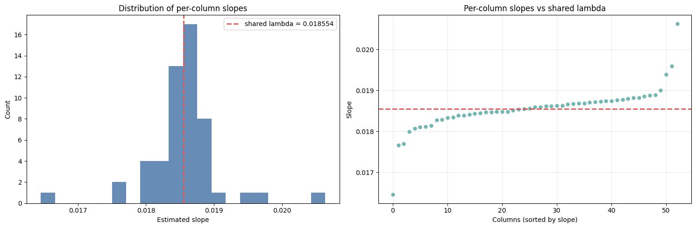

**Detrended time series (after removing shared trend) — isolating column-specific deviations:**

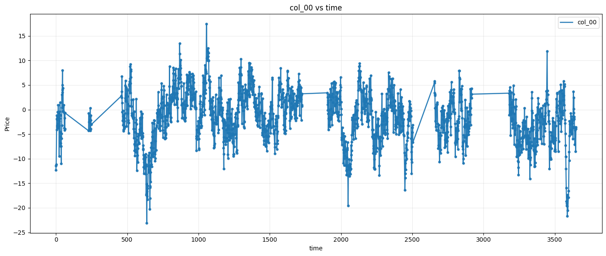

#### Step 2: Temporal Features + Time

Build rolling-window features (windows of 1, 2, 3, 5, 7 rows) to capture local temporal patterns. Add normalized time (row_index / n_rows × 6.4) as a KNN feature so neighbors are close in time, not just in value — important over a 10-year dataset with trending prices.

**Periodic structure in farmer columns** — motivating the use of temporal features:

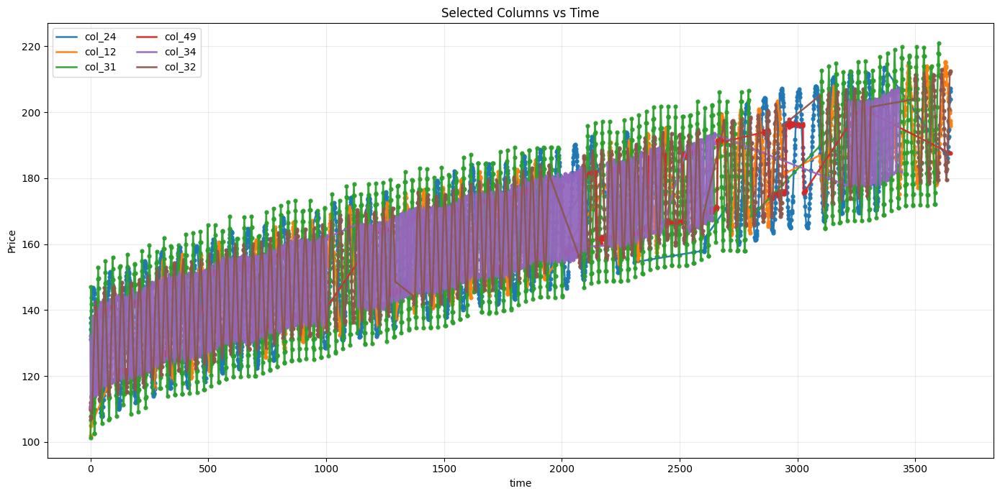

#### Step 3: KNN Ensemble

Run `KNNImputer` with k = 2, 3, 5, 7 and average results. Small k captures local patterns; large k is more robust. The ensemble balances both.

#### Step 4: Add Market Level Back + Long-Gap Fallback

Convert deviations back to prices. For **long gaps** (> 5 rows since last observation), override KNN with a simpler fallback:

```
imputed_price = market_level[row] + column_mean_deviation[col]
```

**Rationale:** KNN relies on temporal neighbors. When a column hasn't been seen in 5+ days, its nearest neighbors in time are stale. The fallback uses today's market level (precise) plus the column's average offset (robust), avoiding KNN's unreliable extrapolation.

#### Step 5: Preserve Original Values

Force all originally observed cells and Step 0 algebraic fills back — these are ground truth and override any KNN output.

#### Step 6: Index Reconstruction + Post-KNN Reverse Inference

Recompute NaN index values from their formula (now that all farmers are filled). Then run reverse inference again on the denser matrix — many equations now solvable that weren't in Step 0.

#### Step 7: Special Handling for col_34 & col_52

These columns showed high KNN imputation error (col_34 had systematic bias). For them only, we discard KNN and allow only:
1. Observed values
2. Algebraic/reverse inference fills
3. **Row-wise median** from the now-dense matrix (excluding themselves)

The row-wise median is robust: by this step, ~51 of 53 columns per row are filled, so the median is computed from a dense vector.

#### Step 8: Safety Net & Save

Fill any remaining NaN with column means, clip to ≥ 0, verify observed values weren't changed, save to `imputed_dataset.csv`.

### Analysis Plots

**Imputation mechanism breakdown — what fraction of fills came from each method:**

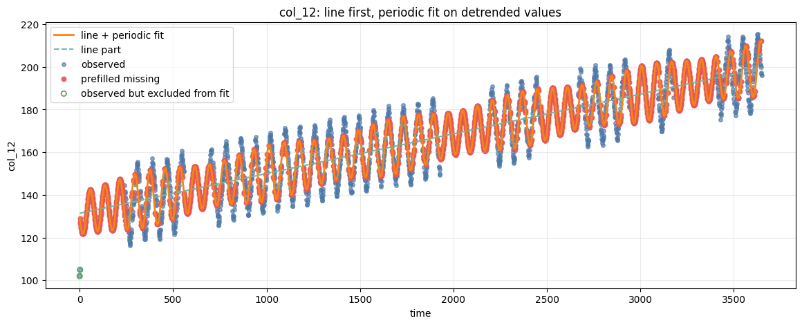
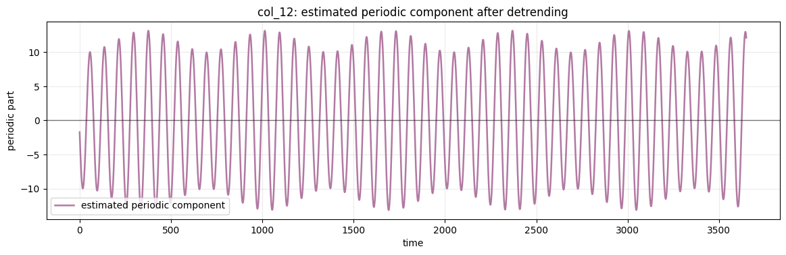

**Periodic prefill diagnostics — validating the periodic component extraction:**

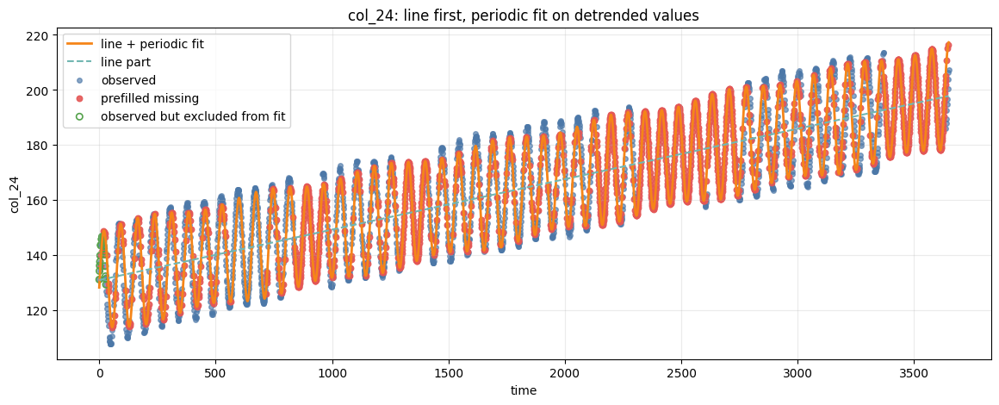
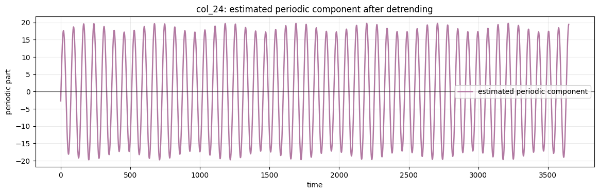

**Imputed time series — sample columns (blue dots = observed, orange = imputed):**

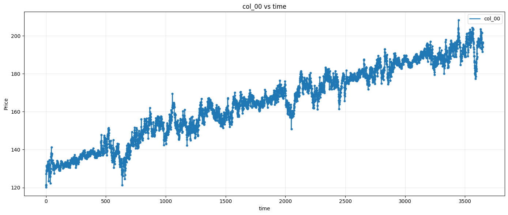
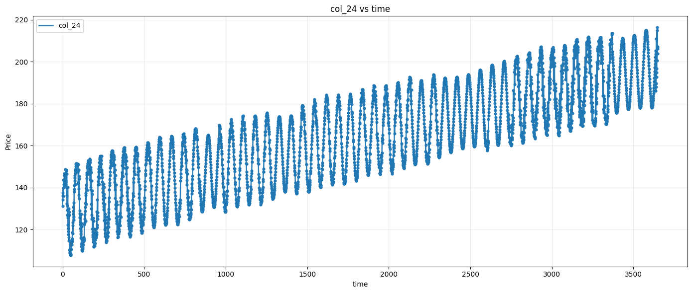
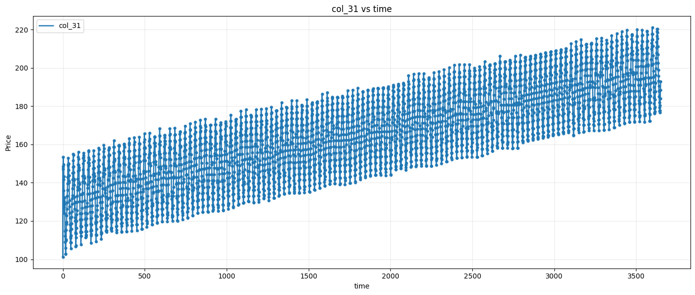
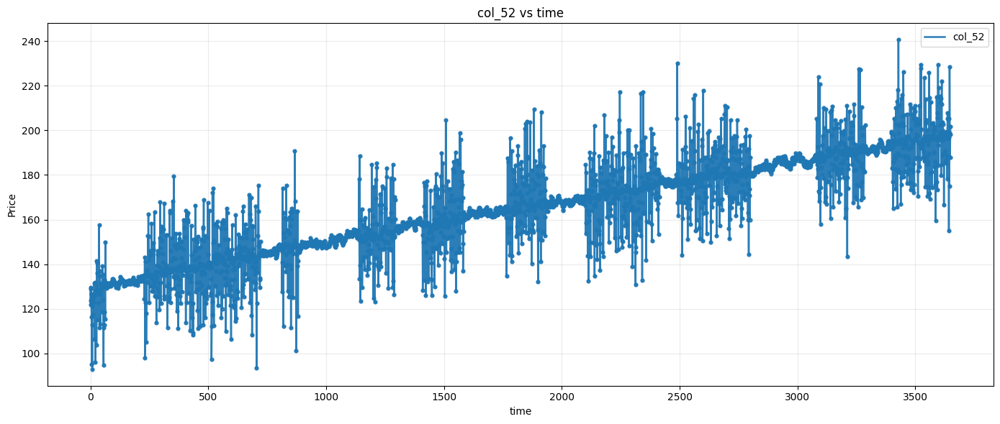

---

## Problem 3: Buy Cheap Flour (Cost Minimization)

### Goal
Each day, buy exactly 100kg from NaN-price (hidden) columns. Minimize total cost.

### Core Decomposition

```
predicted_price = market_level + predicted_deviation
```

- **Market level:** Known precisely from observed columns
- **Deviation:** The real prediction challenge

### Prediction Priority

**Priority 1 — Reverse Inference (Exact):**
Use index formulas to algebraically solve for NaN prices. RMSE ~2.4. Applied when an index and all-but-one farmers are observed.

**Priority 2 — Blended Deviation Prediction:**

Two independent signals, blended adaptively:

| Signal | Source | Strength | Weakness |
|--------|--------|----------|----------|
| **Temporal** | This column's deviation from last 1-3 observed days | Best short-term predictor | Goes stale with gap length |
| **Cross-sectional** | Pairwise regression models from today's observed columns | Uses fresh info (never stale) | Noisier than temporal |

**Blending formula:**
```
predicted_deviation = tw × temporal_dev + (1 − tw) × cross_dev
```

Where `tw = max(0.77^gap, 0.05)`:
- **gap = 1** (yesterday): tw = 0.77 → trust temporal
- **gap = 3**: tw = 0.46 → roughly 50/50
- **gap = 10**: tw = 0.07 → trust cross-sectional
- **gap = 20+**: tw = 0.05 → capped (stale temporal still worth 5%)

**Temporal weight decay curve** — the 0.77 base matches the lag-1 autocorrelation of the deviation series, giving a ~3-day half-life:

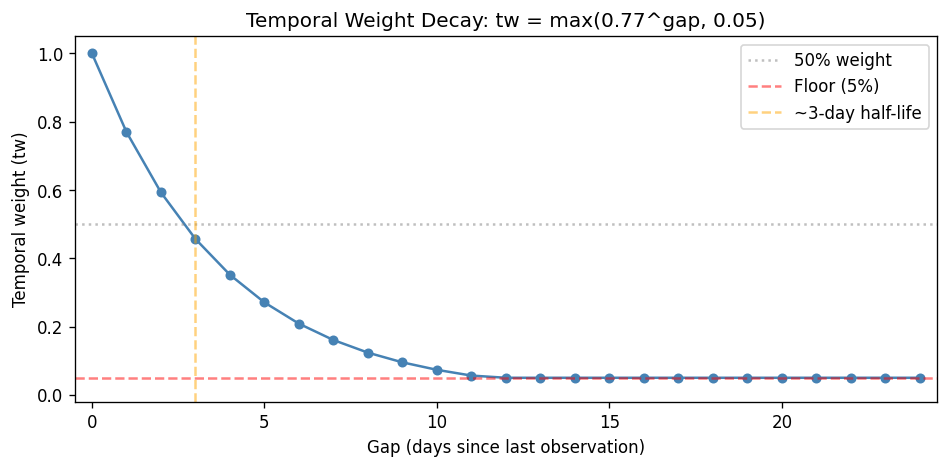

**Deviation autocorrelation by lag** — lag-1 ≈ 0.77 across columns, validating the decay base:

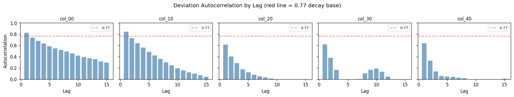

**Cross-sectional models:** ~2,500 pairwise linear regressions `dev[i] ≈ slope × dev[j] + intercept`, R²-weighted at prediction time.

### Trading Decision

Go **all-in** on the predicted cheapest NaN column. Testing showed diversification (top-2, top-3) increases cost — the prediction is accurate enough that the occasional mistake costs less than consistently including non-cheapest columns.

### Results

| Metric | Value |
|--------|-------|
| Excess over oracle | ~4.1% |
| Savings vs uniform | ~4.3% |

---

## Problem 4: Arbitrage

### Goal
Buy from a cheap NaN column, sell to an index column. Maximize profit. Up to 100kg total.

### Strategy

```
profit = (dest_price − src_price) × qty
```

1. **Predict all NaN prices** — same reverse inference + BlendV2 as Problem 3
2. **Destination:** Index columns — use observed price if visible, formula-predicted if NaN
3. **Source:** The cheapest predicted NaN farmer column
4. **Pick best (src, dest) pair** — maximize estimated profit
5. **All 100kg** on the single best pair

### Key Insight

The spread between an index price and the cheapest farmer averages **~13 units**, while prediction RMSE is **~5 units**. The signal-to-noise ratio is strong enough that trading every opportunity (no minimum threshold) maximizes total daily profit.

We tested minimum-spread thresholds:
- Higher thresholds reduce loss rate (14.5% → 5.5%) and improve per-trade profit
- But they skip many profitable trades — capture drops from 67.8% to 41.6%
- **Average profit per day** (what matters) decreases at every threshold

### Results

| Metric | Value |
|--------|-------|
| Oracle capture rate | ~66.3% |
| Loss-making days | ~14% |
| Avg profit/trade day | ~642 |

---

## Problem 5: Limit Orders

### Goal
Place a buy order on a NaN column with a bid price. The order **fills only if bid ≥ true hidden price**. Score = `qty × (median_price − bid_price)` if filled.

### The Tradeoff

```
Lower bid → more profit per fill, but fewer fills
Higher bid → more fills, but less profit per fill
```

### Strategy

1. **Predict all NaN prices** — same pipeline as Problems 3/4
2. **Pick the cheapest** predicted NaN column
3. **Bid = predicted_price + margin**
4. **All 100kg** on that one bid

### Bid Margin Optimization

Sweeping margin from 0 to +5:

| Margin | Fill Rate | Efficiency |
|--------|-----------|------------|
| 0 | ~50% | ~35.6% (best) |
| +1 | ~64% | ~28.1% |
| +3 | ~80% | ~15.2% |
| +5 | ~88% | ~6.3% |

**Margin = 0** (bid at predicted price) is optimal: the tradeoff favors precision over fill rate because each extra unit of margin costs 100 units of score (100kg × 1 unit/kg).

### Results

| Metric | Value |
|--------|-------|
| Fill rate | ~50% |
| Efficiency vs oracle | ~35.6% |

---

## Exploratory Analysis

Additional exploratory analysis from the notebook:

**Global intrinsic value curve** — fitting a polynomial trend to capture the non-linear upward drift shared across all columns:

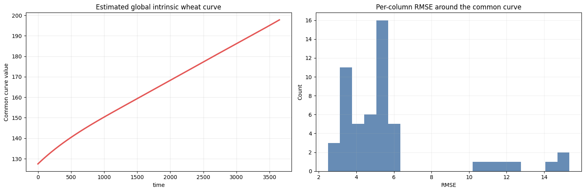
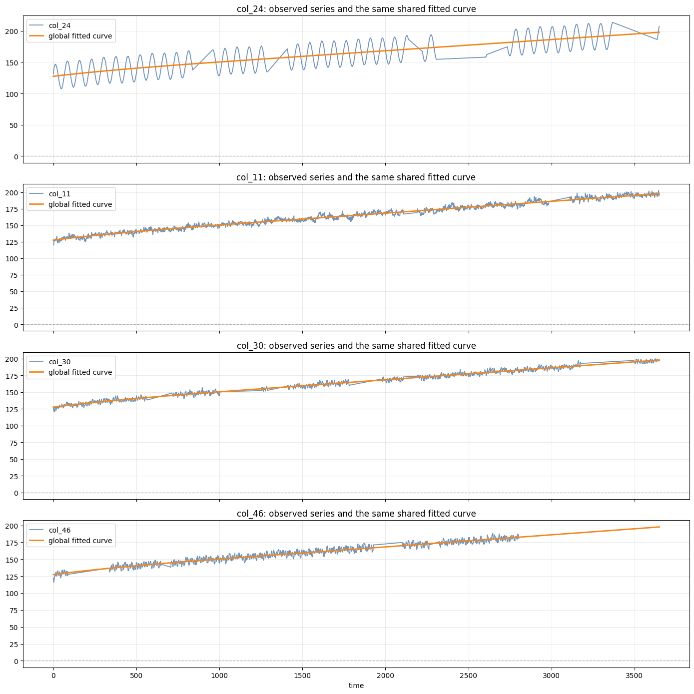

---

## Repository Structure

```
├── README.md                          # This file
├── solution_problem1_v3.py            # Problem 1: Index identification & weights
├── solution_problem2.py               # Problem 2: Imputation pipeline
├── solution_problem3_v2.py            # Problem 3: Cost minimization trading
├── solution_problem4.py               # Problem 4: Arbitrage trading
├── solution_problem5.py               # Problem 5: Limit order trading
├── validate_problem2.py               # Problem 2: Independent validation
├── final_notebook.ipynb               # Full analysis notebook with plots
├── final_notebook_executed.ipynb       # Pre-executed version (all outputs)
└── docs/
    └── images/                        # Analysis plots for README
```

## Tech Stack

- **Python 3.9+**
- **NumPy / Pandas** — data manipulation
- **SciPy** — NNLS regression, FFT, Lomb-Scargle periodogram
- **scikit-learn** — KNNImputer
- **Matplotlib** — all plots and visualizations

## Running

```bash
# Problem 1: Identify indices and compute weights
python3 solution_problem1_v3.py

# Problem 2: Generate imputed_dataset.csv
python3 solution_problem2.py

# Problem 3-5: Backtest trading strategies (requires imputed_dataset.csv)
python3 solution_problem3_v2.py
python3 solution_problem4.py
python3 solution_problem5.py
```

> **Note:** The source data file `limestone_data_challenge_2026.data.csv` is required but not included in this repository.
